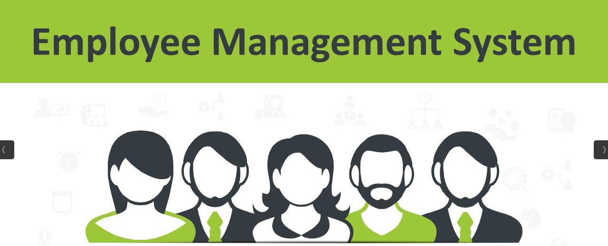

# EMPLOYEE MANAGEMENT

This application has the ability to manage employees based on their role.




## Getting Started

These instructions will get you a copy of the project up and running on your local machine for development 
and testing purposes.

### Prerequisites
Before you can run this project you need a install python first on your operating system.
You can download python [here](https://www.python.org/downloads/) and choose according to your operating system.
n addition you also need a MongoDB NoSQL database and you can download 
[here](https://www.mongodb.com/download-center/community).Also make sure that the mongo is running in your system after installing

```
systemctl start mongod
```

### Installing

First, clone this project from github using git command or git gui application like [fork](https://github.com/meghalrag/qb_employee_management/fork).
```
git clone https://github.com/meghalrag/qb_employee_management.git
```

Making environment for project to isolation python installing libraries for this project only.
```
conda create -n env python=3.10.9
conda activate env
```

### Backend

make backend folder as your base directory by moving to backend folder from terminal

```
cd backend
```

Installing all libraries needed by this project using [pip](https://pypi.org/project/pip/).
```
pip install -r requirements.txt
```

Make a configuration file with name *.env* with this configuration (_change as desired_).
```
MONGODB_SETTINGS = { 'host': 'mongodb://localhost/EMPLOYEE MANAGEMENT' }
JWT_SECRET_KEY = 'employeemanagementwillnotbreach'
```

Setting the environment for this project.
```
export FLASK_APP=app.py
export ENV_FILE_LOCATION=./.env
``` 

Running the project.
```
flask run --port 5000
```

### Frontend

make frontend folder as your base directory by moving to frontend folder from terminal

```
cd ..
cd frontend
```

Installing all libraries needed by this project using [pip](https://pypi.org/project/pip/).
```
pip install -r requirements.txt
```

Running the project.
```
flask run --port 8000
```

### Testing

To test the api endpoint that has been created you can use **curl** utility. Before test, you must login
first to get jwt token and using it in every request header you sent.

```
curl -X POST localhost:5000/api/login -d '{"username":"manager@123.com", "password":"123"}' -H "Content-Type: application/json"
```

#### Swagger UI

You can find the swagger documentation of the api endpoints here:

```
http://127.0.0.1:5000/api/docs
```

### Complete Testing

To test the application completely follow the steps

1. goto [Employee Management Frontend](http://127.0.0.1:8000/)
2. First time you can login into the application using  the following credentials:
email/phone number
```
manager@123.com
```
password
```
123
```
***This is a defualt manager that creates first time when you run the backend appliaction.
If you would like to change the default manager data then in the backend/app.py line 58, 60 and 64 make your desired changes.***

All set to go:sunglasses::v:

### IMPORTANT NOTE:

_There is a variable STORAGE_PATH in both backend and frontend (in backend => export_handler line 7 and in frontend => config.py line 3),
The path specified in it should be accessible to both frontend and backend.Otherwise you need to change this path with an accessible path
in your system._

## Authors

**Meghalrag** - *Initial work* - [meghalrag](https://github.com/meghalrag)


## Acknowledgments

1. My inspiration and More Tutorials [here](https://dev.to/paurakhsharma/flask-rest-api-part-0-setup-basic-crud-api-4650).
2. Flask JWT Extended [Documentation](https://flask-jwt-extended.readthedocs.io/en/stable/)
for _Role-Based Access Control_ (RBAC).
3. Casbin RBAC Model [Documentation](https://casbin.org/docs/rbac/).